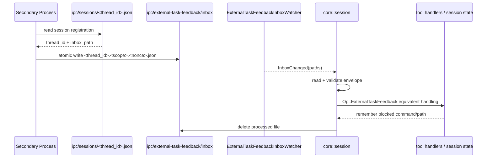

# IPC Feedback Bridge

This document describes the IPC feedback bridge added to Codex so a secondary
local process can communicate structured runtime feedback about the current
task.

The main purpose is to give Codex better context when a tool call fails for a
reason that Codex cannot reliably infer on its own, such as an external block,
policy denial, file lock, or operating-system restriction.

Typical examples:

- a security product blocked a command
- a filesystem monitor denied access to a path
- an orchestration layer cancelled or replaced work
- an external supervisor knows a retry should not happen

## Quick Start

Smallest live demo:

1. Start Codex in one terminal.

```bash
cd /home/USER/repos/codex/codex-rs
unset CODEX_SANDBOX CODEX_SANDBOX_NETWORK_DISABLED
CODEX_SKIP_VENDORED_BWRAP=1 ./target/debug/codex
```

2. In Codex, type:

```text
Say hello, then wait for my next instruction.
```

3. From a second terminal, send session-scoped feedback:

```bash
cd /home/USER/repos/codex
python3 codex-rs/scripts/send_external_task_feedback.py \
  --discover-first \
  --source external_process \
  --severity warning \
  --disposition informational \
  --scope-type session \
  --message "A secondary process reports that this task is under external monitoring. Avoid repeated retries until the condition is clarified."
```

4. Back in Codex, type:

```text
Continue, but account for any external feedback you have received.
```

Expected result:

- Codex ingests the feedback
- the next turn sees it as developer-visible context

Smallest automated check:

```bash
cd /home/USER/repos/codex/codex-rs
unset CODEX_SANDBOX CODEX_SANDBOX_NETWORK_DISABLED
CODEX_SKIP_VENDORED_BWRAP=1 cargo test -p codex-core external_task_feedback_is_included_in_next_model_request -- --nocapture
```

## Executive Summary

The implementation now has two connected layers:

1. Codex has a typed internal feedback path for external task signals.
2. Codex publishes a local file-based IPC surface so secondary processes can
   discover active sessions and submit that feedback.

Once feedback is ingested, Codex can change behavior instead of only logging a
diagnostic. The currently implemented behavior is:

- shell execution can short-circuit retries for blocked commands
- `apply_patch` can short-circuit retries for blocked paths

## What Was Added

### Typed feedback inside Codex

Core protocol types:

- `ExternalFeedbackSource`
- `ExternalFeedbackSeverity`
- `ExternalFeedbackDisposition`
- `ExternalTaskFeedbackScope`
- `ExternalTaskFeedback`
- `ExternalTaskFeedbackEvent`

Core behavior:

- feedback can be submitted as `Op::ExternalTaskFeedback`
- feedback is recorded in session state
- feedback is emitted as `EventMsg::ExternalTaskFeedback`
- shell calls can short-circuit when a matching blocked command was reported
- `apply_patch` can short-circuit when a matching blocked path was reported

### File-based IPC for external processes

Codex now publishes session registration metadata and watches a shared inbox for
external feedback files.

This transport is intentionally file-based because it works on Windows, Linux,
and macOS without adding platform-specific IPC plumbing.

## Files Involved

Primary implementation files:

- `codex-rs/core/src/external_task_feedback_inbox_watcher.rs`
- `codex-rs/core/src/session/session.rs`
- `codex-rs/core/src/session/mod.rs`
- `codex-rs/core/src/session/handlers.rs`
- `codex-rs/core/src/state/session.rs`
- `codex-rs/core/src/tools/handlers/shell.rs`
- `codex-rs/core/src/tools/handlers/apply_patch.rs`
- `codex-rs/protocol/src/protocol.rs`
- `codex-rs/core/src/state/service.rs`

Companion utility and tests:

- `codex-rs/scripts/send_external_task_feedback.py`
- `codex-rs/scripts/test_send_external_task_feedback.py`

## How It Works

Codex exposes two IPC surfaces under `CODEX_HOME`.

```text
CODEX_HOME/
└── ipc/
    ├── sessions/
    │   └── <thread_id>.json
    └── external-task-feedback/
        └── inbox/
            └── <thread_id>.<scope>.<nonce>.json
```

### Session discovery

When a session starts, Codex writes:

```text
CODEX_HOME/ipc/sessions/<thread_id>.json
```

That file includes:

- `thread_id`
- `process_id`
- `cwd`
- `inbox_path`
- `created_at`

This solves the discovery problem for a secondary process. It does not need an
out-of-band channel to learn the active `thread_id`; it can read the session
registry directly.

### Feedback delivery

The secondary process writes a JSON envelope into:

```text
CODEX_HOME/ipc/external-task-feedback/inbox/
```

Codex watches that directory, filters files that match the current thread, reads
the envelope, routes the feedback through the internal handler, and deletes the
file after successful ingestion.

## Envelope Contract

### Envelope shape

```json
{
  "version": 1,
  "thread_id": "thread-123",
  "feedback": {
    "source": "external_process",
    "severity": "warning",
    "disposition": "failed_by_external_actor",
    "scope": {
      "type": "command",
      "command": "git status"
    },
    "message": "Command blocked by endpoint security",
    "observed_at": 1710000000
  }
}
```

### Supported scope types

- `session`
- `turn`
- `tool_call`
- `command`
- `path`

### Supported source values

- `external_process`
- `security_software`
- `operating_system`
- `user`
- `other`

### Supported severity values

- `info`
- `warning`
- `error`

### Supported disposition values

- `informational`
- `failed_by_external_actor`
- `do_not_retry`

## IPC Flow



## How Codex Acts On Feedback

Once ingested, feedback is routed through the same typed path as direct internal
task feedback:

- `handlers::external_task_feedback(...)` records it in session state
- `EventMsg::ExternalTaskFeedback(...)` is emitted to clients
- shell execution checks for matching blocked commands and short-circuits retries
- `apply_patch` checks for matching blocked paths and short-circuits retries

This is the part that changes Codex behavior instead of only logging a
diagnostic.

## Interaction With The Normal Model Loop

The external feedback IPC path does not replace the main model request/response
pipeline. It inserts structured runtime feedback into the same session state the
turn loop already consults.

Relevant surrounding files in the normal model flow:

### Transport and provider interaction

- `codex-rs/core/src/client.rs`
- `codex-rs/codex-api/src/endpoint/responses.rs`

### Stream processing

- `codex-rs/core/src/session/turn.rs`
- `codex-rs/core/src/stream_events_utils.rs`

### Tool execution

- `codex-rs/core/src/tools/router.rs`
- `codex-rs/core/src/tools/parallel.rs`
- `codex-rs/core/src/tools/orchestrator.rs`
- `codex-rs/core/src/tools/registry.rs`

The practical effect is:

1. the model asks Codex to do something
2. Codex executes the tool
3. a secondary process can report that a command or path was blocked
4. Codex records that feedback
5. later tool attempts can short-circuit instead of blindly retrying

## Local Companion Utility

For local testing, use:

- `codex-rs/scripts/send_external_task_feedback.py`

Examples:

```bash
python3 codex-rs/scripts/send_external_task_feedback.py --list-sessions
```

```bash
python3 codex-rs/scripts/send_external_task_feedback.py \
  --discover-first \
  --source external_process \
  --severity warning \
  --disposition informational \
  --message "A secondary process reports that this task is under external monitoring. Avoid repeated retries until the condition is clarified." \
  --scope-type session
```

```bash
python3 codex-rs/scripts/send_external_task_feedback.py \
  --discover-first \
  --source security_software \
  --severity error \
  --disposition do_not_retry \
  --message "Command blocked by endpoint security" \
  --scope-type command \
  --command "git status"
```

```bash
python3 codex-rs/scripts/send_external_task_feedback.py \
  --thread-id <thread_id> \
  --source security_software \
  --severity error \
  --disposition do_not_retry \
  --message "Access denied by policy" \
  --scope-type path \
  --path /path/to/file
```

## Example Prompts

### Session-scoped feedback test case

Use the following prompt in a local Codex session:

```text
Continue, but account for any external feedback you have received.
```

This is the simplest way to verify that a secondary process can influence the
model even when no command has been executed yet.

Inject this feedback from another terminal:

```bash
python3 codex-rs/scripts/send_external_task_feedback.py \
  --discover-first \
  --source external_process \
  --severity warning \
  --disposition informational \
  --scope-type session \
  --message "A secondary process reports that this task is under external monitoring. Avoid repeated retries until the condition is clarified."
```

Expected result:

- Codex ingests the feedback as model-visible developer context
- the next turn reflects that constraint in its reasoning

### Command blocked test case

Use the following prompt in a local Codex session:

```text
Run exactly this command and nothing else: `git status --short --branch`
```

This prompt is intentionally strict because command-scoped feedback currently
matches the command string exactly.

### Blocked-path `apply_patch` test case

Use the following prompt to exercise the blocked-path edit flow:

```text
I want to test external task feedback handling for file access problems.

Please make a small edit to `README.md` by adding a short temporary line near
the end of the file. If the edit succeeds, tell me what changed. If it fails,
explain the failure briefly and decide whether to try again based on any
structured external feedback you receive.

Important behavior for this test:
- If an external process reports that `README.md` is blocked or cannot be
  accessed, do not keep retrying the patch.
- Instead, acknowledge that the file was blocked by an external actor and move
  on to the next best non-blocked step.
- If there is no external feedback, treat it like a normal patch failure and use
  your default behavior.
```

This prompt gives Codex a concrete file mutation target and lets you verify that
path-scoped feedback changes retry behavior for `apply_patch`.

## Local Test Walkthrough

### 1. Start Codex locally

Start a normal local Codex session in this repository.

Once the session is running, list discovered sessions:

```bash
python3 codex-rs/scripts/send_external_task_feedback.py --list-sessions
```

You should see one or more registration objects with a `thread_id`.

### 2. Minimal live session-scoped demo

Paste this into the running Codex session:

```text
Say hello, then wait for my next instruction.
```

Then inject session-wide feedback from another terminal:

```bash
python3 codex-rs/scripts/send_external_task_feedback.py \
  --discover-first \
  --source external_process \
  --severity warning \
  --disposition informational \
  --scope-type session \
  --message "A secondary process reports that this task is under external monitoring. Avoid repeated retries until the condition is clarified."
```

Expected result:

- the helper writes an inbox file for the active thread
- Codex ingests the file
- the next model turn includes the feedback as developer-visible context

Now send this follow-up prompt in Codex:

```text
Continue, but account for any external feedback you have received.
```

### 3. Exact command-match demo

Paste the command test prompt from the previous section into the running Codex
session.

Then inject matching command feedback from another terminal:

```bash
python3 codex-rs/scripts/send_external_task_feedback.py \
  --discover-first \
  --source security_software \
  --severity error \
  --disposition do_not_retry \
  --message "git status --short --branch was blocked by endpoint protection" \
  --scope-type command \
  --command "git status --short --branch"
```

Expected result:

- the helper writes an inbox file for the active thread
- Codex ingests the file
- the shell handler recognizes the command as blocked
- Codex stops retrying that exact command

### 4. Paste the blocked-path prompt

Paste the blocked-path prompt into the running Codex session.

### 5. Inject path feedback from another terminal

```bash
cd /path/to/your/codex/repo
python3 codex-rs/scripts/send_external_task_feedback.py \
  --discover-first \
  --source operating_system \
  --severity error \
  --disposition do_not_retry \
  --message "README.md is locked by another process" \
  --scope-type path \
  --path "$(pwd)/README.md"
```

Expected result:

- the helper writes a path-scoped inbox file for the active thread
- Codex ingests the file
- the `apply_patch` handler recognizes the path as blocked
- Codex stops retrying edits against that file

## Test Coverage

### Python helper tests

Run:

```bash
python3 -m unittest codex-rs/scripts/test_send_external_task_feedback.py
```

Coverage:

- session registrations can be listed
- a feedback envelope is written for a discovered session

### Rust feedback tests

Run:

```bash
cd codex-rs
CODEX_SKIP_VENDORED_BWRAP=1 cargo test -p codex-core external_task_feedback -- --nocapture
CODEX_SKIP_VENDORED_BWRAP=1 cargo test -p codex-core external_task_feedback_is_included_in_next_model_request -- --nocapture
```

Coverage:

- inbox watcher forwards file events
- session registration file is written
- inbox files are ingested
- external feedback is recorded and emitted
- active-turn feedback is injected into model-visible input
- idle feedback is recorded so it appears on the next model request

### Rust behavior tests

Run:

```bash
cd codex-rs
CODEX_SKIP_VENDORED_BWRAP=1 cargo test -p codex-core shell_handler_short_circuits_blocked_command_feedback -- --nocapture
CODEX_SKIP_VENDORED_BWRAP=1 cargo test -p codex-core apply_patch_handler_short_circuits_blocked_path_feedback -- --nocapture
```

Coverage:

- shell does not keep retrying a command that was externally marked blocked
- `apply_patch` does not keep retrying a path that was externally marked blocked


## Why This IPC Shape Fits

This approach is intentionally simple:

- cross-platform
- no sockets or named pipes to secure and debug
- easy to inspect manually during development
- easy for external processes written in any language
- durable enough for short-lived agent or security events

If this grows further, the same registry-plus-inbox contract can later be
wrapped by:

- a local service
- named pipes
- OS-native notifications
- an app-server RPC endpoint

without changing the core feedback semantics.

## Minimal Debugging Path

If you want to step through the broader model interaction around this feature,
this is the shortest useful chain:

1. `tui/src/chatwidget.rs` or `app-server/src/codex_message_processor.rs`
2. `core/src/tasks/regular.rs`
3. `core/src/session/turn.rs::run_turn`
4. `core/src/session/turn.rs::build_prompt`
5. `core/src/client.rs::ModelClientSession::build_responses_request`
6. `core/src/client.rs::ModelClientSession::stream`
7. `codex-api/src/endpoint/responses.rs::stream_request`
8. `core/src/session/turn.rs` streamed `ResponseEvent` match
9. `core/src/stream_events_utils.rs::handle_output_item_done`
10. `core/src/tools/router.rs::build_tool_call`
11. `core/src/tools/parallel.rs::handle_tool_call`
12. feedback ingestion in `core/src/session/mod.rs`
13. next iteration of `run_turn`

## Current Limitations

- the IPC transport is local file-based only
- `--discover-first` is fine for local testing but not ideal for multi-session
  routing in production
- the current short-circuit behavior is implemented for command and path retry
  prevention, not for every tool or failure mode
- command-scoped matching is currently exact string matching
- session-scoped feedback is the best current choice when no command has run yet

## Recommended Next Steps

- expose external feedback events in the TUI or app-server UI
- add stronger multi-session targeting rules for automation
- add more behavior hooks for other tool types
- optionally add a higher-level local service on top of the same registry and
  inbox contract


## Quiz

A local quiz generator is also included to help verify that someone understands
the high-level architecture described in `docs/model-interaction-report.md`.

Script:

- `codex-rs/scripts/model_interaction_quiz.py`

What it does:

- generates a multiple-choice quiz from the model interaction report
- includes at least 15 questions by default
- randomizes question order and answer order
- supports `--seed` for deterministic quiz generation
- supports `--interactive` for one-question-at-a-time terminal use
- supports `--show-answers` and `--markdown`

### Run the quiz

From the repo root:

```bash
python3 codex-rs/scripts/model_interaction_quiz.py
```

### Run the quiz interactively

```bash
python3 codex-rs/scripts/model_interaction_quiz.py --interactive
```

### Run the quiz with a fixed seed

```bash
python3 codex-rs/scripts/model_interaction_quiz.py --seed 7
```

### Show the answer key

```bash
python3 codex-rs/scripts/model_interaction_quiz.py --show-answers
```

### Generate markdown output

```bash
python3 codex-rs/scripts/model_interaction_quiz.py --markdown --show-answers > model-interaction-quiz.md
```

### Run the quiz tests

```bash
python3 -m unittest codex-rs/scripts/test_model_interaction_quiz.py
```


```
is it updated?


• No. README.md was not updated.

  The edit attempt on README.md was blocked by an external security control, and the runtime indicated not to retry until that condition is cleared.
```
