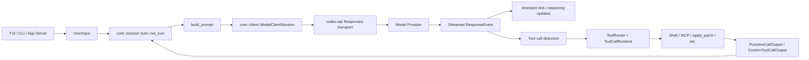
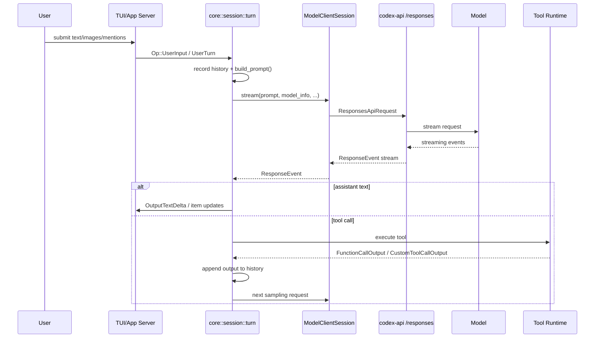
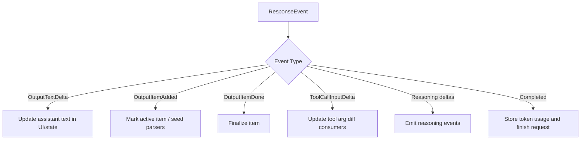
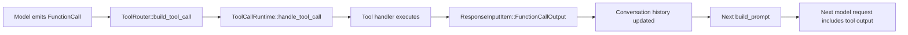

# Model Interaction Report

This report maps where the Codex repository interacts with the model to:

- receive user prompts
- assemble model-visible context
- send requests to the model
- receive streamed model output
- execute model-requested tools
- feed tool results back into the next model request

The focus is the current Rust implementation in `codex-rs/`, because that is where the live prompt and response pipeline is implemented.

## Executive Summary

The core request/response loop is centered around these files:

- `codex-rs/core/src/session/turn.rs`
- `codex-rs/core/src/client.rs`
- `codex-rs/core/src/client_common.rs`
- `codex-rs/core/src/stream_events_utils.rs`
- `codex-rs/core/src/tools/router.rs`
- `codex-rs/core/src/tools/parallel.rs`
- `codex-rs/codex-api/src/endpoint/responses.rs`

In practical terms, the flow is:

1. A client surface such as the TUI or app-server collects `UserInput`.
2. Core session code records that input into conversation history.
3. `build_prompt(...)` constructs a `Prompt` from history, base instructions, tool specs, personality, and output schema.
4. `ModelClientSession::stream(...)` turns that `Prompt` into a `ResponsesApiRequest` and sends it over WebSocket or HTTP.
5. Model output arrives as streamed `ResponseEvent`s.
6. Assistant text is forwarded to the UI incrementally.
7. Tool calls emitted by the model are recognized, executed, and converted into `FunctionCallOutput`-style items.
8. Those tool outputs are appended to history and included in the next request to the model.

## Core Concepts

### `UserInput`

User-facing clients produce typed input items such as:

- text
- local images
- remote images
- skill mentions
- plugin or app mentions

Those are later converted into model-visible `ResponseItem`s.

Relevant examples:

- `codex-rs/tui/src/chatwidget.rs`
- `codex-rs/app-server/src/codex_message_processor.rs`

### `Prompt`

The main turn payload is the `Prompt` type:

- `input: Vec<ResponseItem>`
- `tools: Vec<ToolSpec>`
- `parallel_tool_calls`
- `base_instructions`
- `personality`
- `output_schema`

Defined in:

- `codex-rs/core/src/client_common.rs`

### `ResponsesApiRequest`

This is the transport-facing request body sent to the model provider. It contains:

- `model`
- `instructions`
- `input`
- `tools`
- `tool_choice`
- `parallel_tool_calls`
- `reasoning`
- `service_tier`
- `text`

This is built from `Prompt` inside the core client layer.

### `ResponseEvent`

Model output is streamed back as `ResponseEvent`s, including:

- `Created`
- `OutputItemAdded`
- `OutputItemDone`
- `OutputTextDelta`
- `ToolCallInputDelta`
- `ReasoningSummaryDelta`
- `ReasoningContentDelta`
- `Completed`

These events drive UI updates and tool execution.

## High-Level Architecture

## End-to-End Turn Flow

## Entry Points: Where User Prompts Begin

### TUI

The TUI collects the raw prompt contents in:

- `codex-rs/tui/src/chatwidget.rs`

Key behavior:

- Builds `Vec<UserInput>` from text, remote images, local images, skill mentions, plugin mentions, and app mentions.
- Special-cases `!cmd` to run a local shell command directly instead of sending to the model.

Useful references:

- `codex-rs/tui/src/chatwidget.rs:5371`
- `codex-rs/tui/src/chatwidget.rs:5401`
- `codex-rs/tui/src/chatwidget.rs:5434`
- `codex-rs/tui/src/chatwidget.rs:5471`
- `codex-rs/tui/src/chatwidget.rs:5507`

### App Server

The app-server maps incoming RPC `TurnStartParams.input` into core input items in:

- `codex-rs/app-server/src/codex_message_processor.rs`

Key behavior:

- Validates input limits.
- Converts v2 `UserInput` to core input.
- Applies optional per-turn overrides such as model, effort, summary, sandbox policy, and collaboration mode.
- Submits `Op::UserInput` to the core thread/session.

Useful references:

- `codex-rs/app-server/src/codex_message_processor.rs:7064`
- `codex-rs/app-server/src/codex_message_processor.rs:7107`
- `codex-rs/app-server/src/codex_message_processor.rs:7150`

### Regular Task Execution

Normal turn execution enters here:

- `codex-rs/core/src/tasks/regular.rs`

This code calls `run_turn(...)`, which is the main model interaction loop.

Useful reference:

- `codex-rs/core/src/tasks/regular.rs:68`

## Prompt Assembly

Prompt assembly happens in:

- `codex-rs/core/src/session/turn.rs`

### `build_prompt(...)`

This function is the main place where Codex decides what the model will see for a turn.

It takes:

- the current input/history items
- the tool router
- the turn context
- base instructions

It produces a `Prompt` containing:

- model-visible history
- model-visible tool specs
- whether parallel tool calls are allowed
- base instructions
- personality
- final output schema

Useful references:

- `codex-rs/core/src/session/turn.rs:946`
- `codex-rs/core/src/session/turn.rs:968`

### Tool visibility at prompt time

The prompt only contains tools the model is supposed to know about. Deferred dynamic tools can be filtered out before the request is sent.

That filtering happens inside `build_prompt(...)`.

### Base instructions

Base instructions are pulled from session state in:

- `codex-rs/core/src/session/mod.rs`

Useful reference:

- `codex-rs/core/src/session/mod.rs:1202`

One example of a shipped prompt template is:

- `codex-rs/core/gpt_5_2_prompt.md`

Model-specific instruction templating also exists in:

- `codex-rs/protocol/src/openai_models.rs`

Useful reference:

- `codex-rs/protocol/src/openai_models.rs:329`

## Sending Requests to the Model

The transport-facing logic lives primarily in:

- `codex-rs/core/src/client.rs`
- `codex-rs/codex-api/src/endpoint/responses.rs`

### `ModelClientSession::build_responses_request(...)`

This converts the abstract `Prompt` into a concrete `ResponsesApiRequest`.

It maps:

- `prompt.base_instructions.text` -> `instructions`
- `prompt.get_formatted_input()` -> `input`
- `prompt.tools` -> Responses API `tools`
- `turn_context.model_info.slug` -> `model`
- reasoning config -> `reasoning`
- output schema / verbosity -> `text`

Useful reference:

- `codex-rs/core/src/client.rs:808`

### Transport selection

The top-level streaming method is:

- `ModelClientSession::stream(...)`

Behavior:

- Prefers Responses-over-WebSocket when supported and healthy.
- Falls back to HTTP Responses API when necessary.

Useful reference:

- `codex-rs/core/src/client.rs:1423`

### HTTP `/responses` path

The HTTP path is implemented in:

- `codex-rs/codex-api/src/endpoint/responses.rs`

Behavior:

- Serializes `ResponsesApiRequest`
- Adds conversation and session headers
- POSTs to `responses`
- Requests `text/event-stream`
- Wraps the stream into `ResponseStream`

Useful references:

- `codex-rs/codex-api/src/endpoint/responses.rs:69`
- `codex-rs/codex-api/src/endpoint/responses.rs:115`

### WebSocket path

WebSocket request creation and streaming are implemented in:

- `codex-rs/core/src/client.rs`

Useful references:

- `codex-rs/core/src/client.rs:1229`
- `codex-rs/core/src/client.rs:1257`
- `codex-rs/core/src/client.rs:1320`

## Receiving Streamed Model Output

The core streamed event loop lives in:

- `codex-rs/core/src/session/turn.rs`

Useful reference:

- `codex-rs/core/src/session/turn.rs:1838`

### Event handling overview

### Important event branches

#### `OutputTextDelta`

Incremental assistant text is emitted as the model streams tokens.

Useful reference:

- `codex-rs/core/src/session/turn.rs:2097`

#### `OutputItemAdded`

This marks the beginning of a model output item and sets up state for:

- active assistant items
- tool argument diff consumers
- streamed rendering

Useful reference:

- `codex-rs/core/src/session/turn.rs:1990`

#### `OutputItemDone`

This is the most important branch for tool execution. When an item is complete, Codex decides whether it is:

- plain assistant output
- reasoning
- a tool call that must be executed

Useful reference:

- `codex-rs/core/src/session/turn.rs:1911`

#### `Completed`

This marks the end of the model response, flushes remaining text state, and updates token accounting.

Useful reference:

- `codex-rs/core/src/session/turn.rs:2077`

## Acting on Model Tool Calls

Tool-call execution is split across three layers:

1. detect a tool call in a completed model output item
2. translate it into an internal `ToolCall`
3. execute it and convert the result back into a model-visible output item

### Step 1: detect tool calls from model output

This happens in:

- `codex-rs/core/src/stream_events_utils.rs`

`handle_output_item_done(...)` calls `ToolRouter::build_tool_call(...)`. If the completed item is a tool call, it:

- records the item in history
- queues an async tool execution future
- marks the turn as needing follow-up

Useful references:

- `codex-rs/core/src/stream_events_utils.rs:210`
- `codex-rs/core/src/stream_events_utils.rs:218`
- `codex-rs/core/src/stream_events_utils.rs:236`

### Step 2: convert model items into internal tool calls

This happens in:

- `codex-rs/core/src/tools/router.rs`

`ToolRouter::build_tool_call(...)` recognizes:

- `ResponseItem::FunctionCall`
- `ResponseItem::CustomToolCall`
- `ResponseItem::ToolSearchCall`
- `ResponseItem::LocalShellCall`

It then converts them into internal `ToolCall` values with a parsed `ToolPayload`.

Useful references:

- `codex-rs/core/src/tools/router.rs:171`
- `codex-rs/core/src/tools/router.rs:177`
- `codex-rs/core/src/tools/router.rs:222`
- `codex-rs/core/src/tools/router.rs:232`

### Step 3: execute the tool

This happens in:

- `codex-rs/core/src/tools/parallel.rs`

`ToolCallRuntime::handle_tool_call(...)`:

- executes the tool
- supports parallel execution when allowed
- converts success into a `ResponseInputItem`
- converts non-fatal failures into `FunctionCallOutput`-style error payloads

Useful references:

- `codex-rs/core/src/tools/parallel.rs:63`
- `codex-rs/core/src/tools/parallel.rs:83`
- `codex-rs/core/src/tools/parallel.rs:145`

### Tool approvals and sandboxing

Approval routing and sandbox policy enforcement live in:

- `codex-rs/core/src/tools/orchestrator.rs`

That layer is where Codex decides whether a tool call:

- can run immediately
- needs user approval
- should retry under a different sandbox strategy
- must be rejected

This is not the point where the model is contacted, but it is the point where model-emitted actions are mediated before execution.

## How Tool Results Get Back to the Model

The result of a tool call is turned back into a model-visible input item such as:

- `FunctionCallOutput`
- `CustomToolCallOutput`
- `ToolSearchOutput`
- `McpToolCallOutput`

That happens through the tool runtime and tool output abstractions, ultimately returning a `ResponseInputItem` that is appended to conversation history.

Then, on the next sampling request, the turn loop rebuilds the prompt from history and sends that tool output back to the model.

This feedback loop is the core of agent behavior in Codex.

## Main Files by Responsibility

### User entry points

- `codex-rs/tui/src/chatwidget.rs`
- `codex-rs/app-server/src/codex_message_processor.rs`
- `codex-rs/core/src/tasks/regular.rs`

### Prompt construction

- `codex-rs/core/src/session/turn.rs`
- `codex-rs/core/src/client_common.rs`
- `codex-rs/core/src/session/mod.rs`
- `codex-rs/protocol/src/openai_models.rs`

